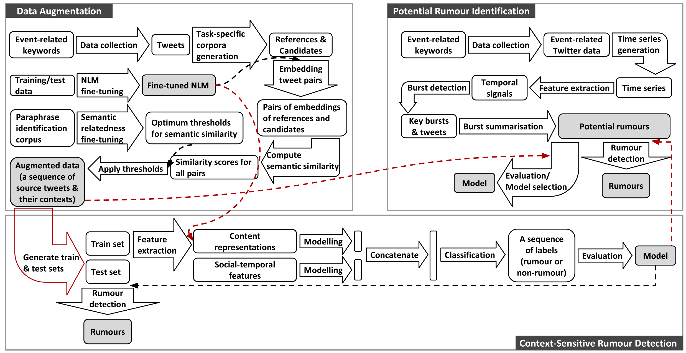

<!-- 

  
  : Connecting digital mobility assessment to clinical outcomes for regulatory and clinical endorsement

-->

Current projects 

 Requests for Information (RFIs) decomposition (£20K) 

This project is funded by the Defence Science and Technology Laboratory. More details will be shared soon!

<!--
Bot/Cyborg detection (£10k) 

This project is funded by one of the UK government agencies, the Defence Science and Technology Laboratory. More details will be shared soon!
-->
<!-- This project was launched at University Technology Centre in AI for Defence and Security, which is funded by one of the UK government agencies, the Defence Science and Technology Laboratory. -->

 
<a href="https://www.mobilise-d.eu/" target="_blank">Mobilise-D</a>: connecting digital mobility assessment to clinical outcomes for regulatory and clinical endorsement

The overarching objectives of Mobilise-D are threefold:  

<ol>
  <li>to deliver a valid solution for real-world digital mobility assessment;</li>
  <li>to validate digital mobility outcomes to predict clinical endpoints in Chronic Obstructive Pulmonary Disease, Parkinson’s Disease, Multiple Sclerosis, Proximal Femoral Fracture Recovery and Congestive Heart Failure;</li>
  <li>to obtain key regulatory and health stakeholder approval for digital mobility assessment.
 Global value over €50M. Value for Sheffield is over €2M.</li>
</ol>

My research aims in this project are 
<ol>
 <li>connecting large-scale digital mobility outcomes obtained via mobile phones with
large-scale location semantics; and contextual information (e.g. weather, types of movement, etc.)</li>
 <li>identifying events associated with the mobility and vitality of patients</li></ol>

 
Past projects 

Context-aware message-level rumour detection with weak supervision

This research project focuses on researching early rumour detection (ERD) on social media by exploiting  weak supervision and contextual information. Weak supervision is a branch of Machine Learning (ML) where noisy and less precise sources (e.g. data patterns) are leveraged to learn limited high-quality labelled data. This is intended to reduce the cost and increase the efficiency of the hand-labelling of large-scale data. 

The aim is to study whether identifying rumours before they go viral is possible and develop an architecture for ERD at individual post level. To this end, it first explores the following three major bottlenecks of state-of-the-art ERD: 
<ol>
  <li>labelled data scarcity and class imbalance</li>
  <li>enormous amounts of noisy data</li>
  <li>the limited availability of context in message-level ERD</li>
</ol>

Figure 1 visualises an overview of research design for addressing the bottlenecks introduced above.

This project also uncovers a research gap between system design and its applications in the real world, which have received less attention from the research community of ERD. 

<figure>
  
  <figcaption>Figure 1: Project overview
</figure>

 
<!-- 
<a href="https://www.nhs.uk/oneyou/for-your-body/move-more/active-10" target="_blank">Active 10</a>

This is a project funded by Public Health England. It concerns the use of our mobile tracking technology to support moving more by citizens. The resulting App, Active 10, has been downloaded over 620,000 times in England. Check the link for details of the Active 10 app which is featured in the television program '<a href="http://www.bbc.co.uk/news/health-42864061" target="_blank">The Truth About Getting Fit</a>' screened on BBC1 on 31 January 2018. Our servers have collected over a billion data points about mobility over 3 years.

 
-->
<a href="http://setamobility.eu/" target="_blank">SETA</a>: ubiquitous data and service ecosystem for better metropolitan mobility

The objective of this project is to provide effective solutions for intelligent and sustainable mobility - i.e. the smarter, greener and more efficient movement of people and goods. SETA will provide a radical change from transport as a series of separate modal journeys to an integrated, reactive, intelligent, mobility system. It will provide always-on, pervasive services to citizens and business, as well as decision-makers to support safe, sustainable, effective, efficient and resilient mobility. The project lasts three years, with €5.5m of funding from EU Horizon 2020 of which €1.2m is for Sheffield.<a href="https://staffwww.dcs.shef.ac.uk/people/F.Ciravegna/Fabio_Ciravegna/About.html" target="_blank">Professor Fabio Ciravegna</a> is the project director (2016-2019).

 
<a href="https://footballwhispers.com/" target="_blank">Football Whispers</a>

This is an industrial project that mines information from millions of social media messages and to predict football transfers by analysing related rumours on social media. Football Whispers is the world’s first football transfer predictor, built by football fans for football fans. We sort the dead certs from long shots. We show you who’s really moving and who’s staying put; all with our unique Football Whispers Index.

